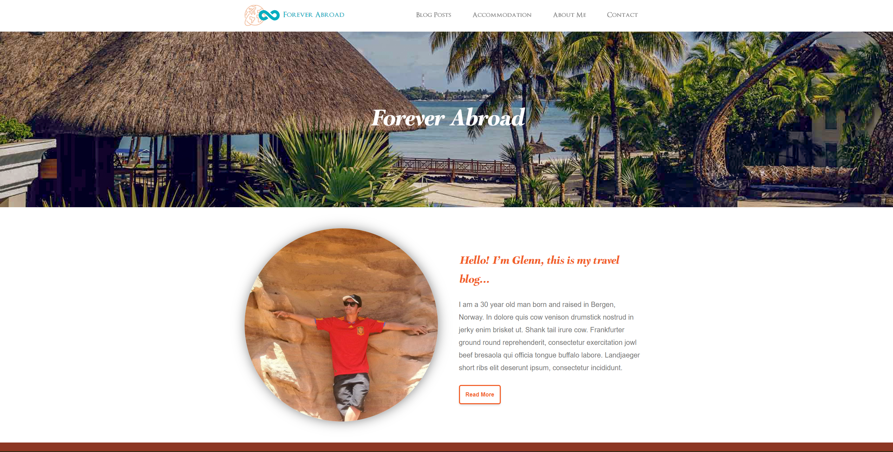

# Forever Abroad - Blog

## Description

Forever Abroad is a travel blog which includes the following pages:

- Home page
- About page
- List of blog posts
- Blog post specific pages
- Contact page

The home page have a ‘Latest Posts’ section which uses a carousel (slider) for users to click to view more posts.
The blog posts page show the first 10 blogs, and the user should click to view more results which then show underneath the first 10 blogs.
The content of the blog specific page is be dynamically built using a query string parameter based on whatever link the user clicked. The title of the blog specific page will change based on the blog that has been clicked on e.g. “My Blog | An Article I Wrote”.

If images on the blog post page are clicked, a modal will appear giving the user a bigger view of that image. Clicking outside the image will hide the modal.

The contact page has validation rules.

The content for the website is stored on a WordPress installation used as a Headless CMS.

## Built With

- Javascript
- HTML
- CSS
- Wordpress rest API

## Getting Started

### Installing

1. Clone the repo:
   `git clone https://github.com/glennlarsen/project-exam-1-glennlarsen-portfolio-1.git`
   Clones the repo to your choosen destination.

### Running

Install the visual studio code plugin `Live server` and run the project locally by right clicking the index file and choose `Open with live server`.

### Wordpress CMS

The wordpress CMS is currently taken down, so the content is not available. Create your own API to provide content to the site.

### Live site

The site is currently deployed on netlify on this link: `https://nervous-brahmagupta-75bf12.netlify.app/`

## Contributing

Contributions to the project are very much appreaciated. To contribute please open a pull request so the code can be reviewed.

## Contact

[My LinkedIn Page](https://www.linkedin.com/in/glenn-larsen-288173242/)\
[My Portfolio](https://glennportfolio.site)

